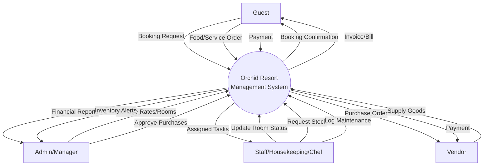
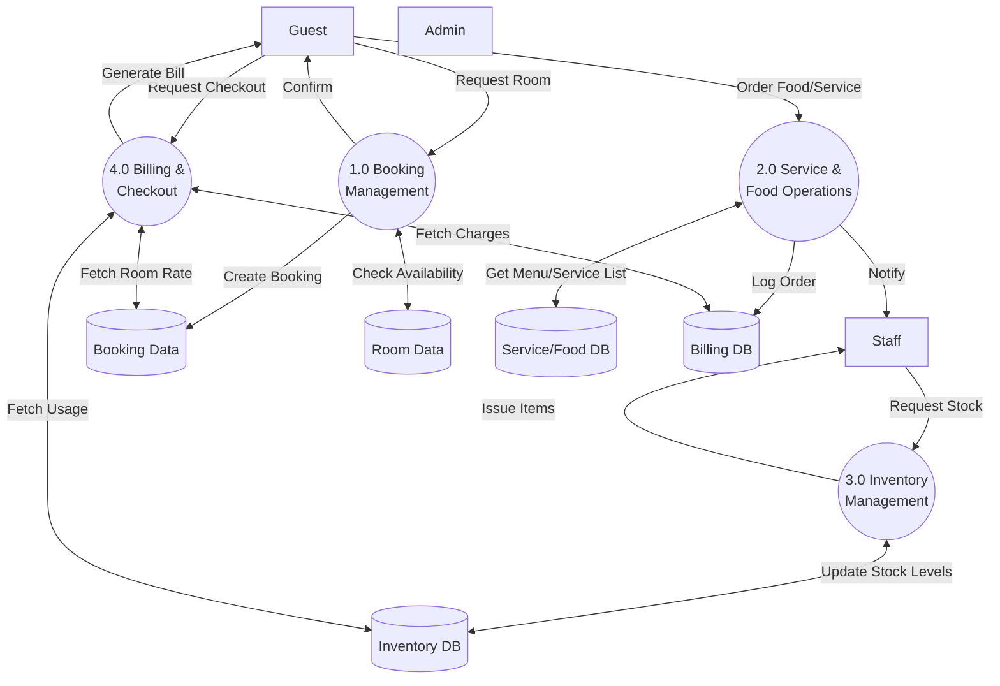
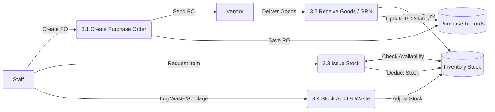
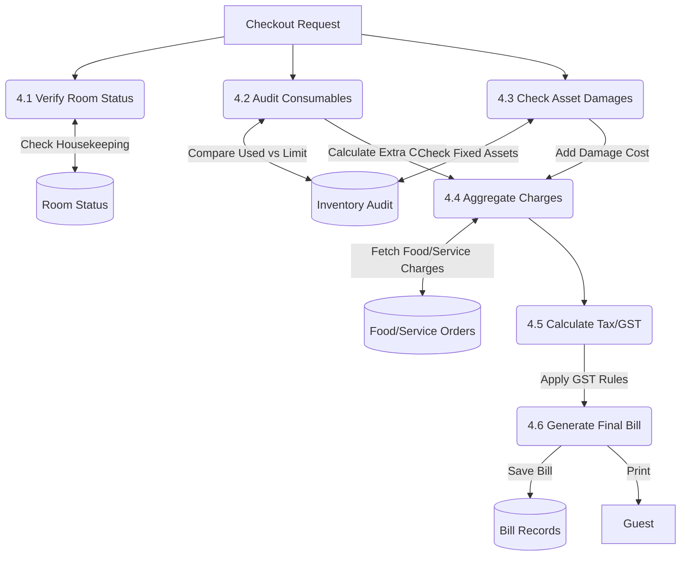

# Detailed Data Flow Diagram (DFD) - Orchid Resort System

This document provides a detailed breakdown of the data flow within the Orchid Resort Management System, visualizing how information moves between external entities, processes, and data stores.

## Level 0: Context Diagram
*The highest level view, showing the system as a single black box interacting with external entities.*

---

## Level 1: System Decomposition
*Breaking down the main system into its core functional modules.*

---

## Level 2: Detailed Process Breakdown

### 2.1 Inventory Management Process
*Detailed flow of how inventory is purchased, stocked, and issued.*

### 2.2 Billing & Checkout Logic
*The complex logic of aggregating charges from various sources to form the final bill.*

## Detailed Explanation of Processes

### 1. Booking Management
*   **Input:** Guest details, Check-in/out dates, Room type.
*   **Process:** The system checks `Room Data` for availability. If available, it creates a record in `Booking Data` and continually updates the room status (Available -> Booked -> Occupied).
*   **Output:** Booking ID, Confirmation SMS/Email.

### 2. Service & Food Operations
*   **Input:** Food Orders (Dine-in/Room Service), Laundry requests, Housekeeping requests.
*   **Process:** Orders are logged against the `Booking ID` and `Room ID`. The kitchen staff receives the order, prepares it, and updates status.
*   **Inventory Link:** Preparing food deducts ingredients from `Inventory DB` (Logic 1.2).
*   **Output:** Service delivered, Charge added to user's "Unbilled" list.

### 3. Inventory Management
*   **Purchase:** Purchasing creates a PO. When goods arrive, `GRN (Goods Received Note)` is processed, increasing `Location Stock`.
*   **Issuance:** Staff "indents" or requests items. If approved, stock moves from "Main Warehouse" to "Kitchen" or "Housekeeping".
*   **Consumption:**
    *   **Consumables:** Deducted when moved to a room or used in a service.
    *   **Fixed Assets:** Tracked by location. Moved but not "consumed" unless damaged/lost.

### 4. Billing & Checkout (The Core Logic)
This is the most critical phase where all data converges.
1.  **Checkout Request:** A pre-check initiated by the Front Desk.
2.  **Verification:**
    *   Housekeeping checks the room.
    *   **Consumables Audit:** System compares "Initial Stock" vs "Actual Left". If usage > complimentary limit, the excess is charged.
    *   **Asset Check:** Verified against the `Asset Registry`. Missing/Damaged items trigger a charge.
3.  **Aggregation:** The system pulls:
    *   Room Charges (Days * Rate).
    *   Food Orders (sum of `food_orders`).
    *   Service Charges (Laundry, Spa, etc.).
    *   Inventory Charges (Consumables overuse).
    *   Damage Charges (Asset damages).
4.  **Taxation:** Appropriate GST (12%, 18%, etc.) is applied to each category separately.
5.  **Finalization:** Payment is processed, and the Booking is marked "Completed". inventory for the room is reset.
