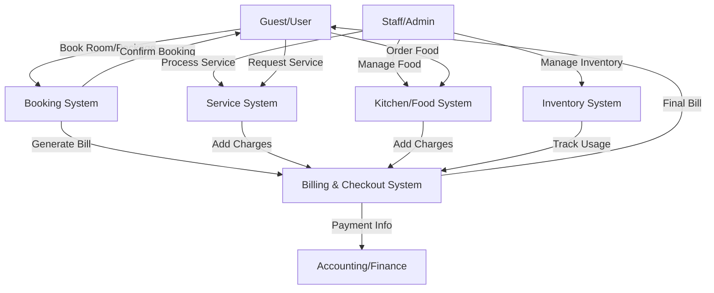

# System Architecture Documentation

## 1. Entity Relationship Diagram (ERD)

```mermaid
erDiagram
    %% User Management
    User ||--o| Employee : "linked to"
    User }|--|{ Role : "assigned"
    User ||--o{ Booking : "makes"
    User ||--o{ PackageBooking : "makes"

    %% Employee Management
    Employee ||--o{ Attendance : "logs"
    Employee ||--o{ Leave : "requests"
    Employee ||--o{ WorkingLog : "tracks"
    Employee ||--o{ Expense : "incurs"
    Employee ||--o{ AssignedService : "performs"

    %% Room Management
    Room }|--|| Location : "located at"
    Room ||--o{ BookingRoom : "booked in"
    Room ||--o{ PackageBookingRoom : "booked in package"
    Room ||--o{ AssignedService : "service assigned"
    Room ||--o{ FoodOrder : "orders food"

    %% Booking System
    Booking ||--|{ BookingRoom : "includes"
    Booking ||--o| Checkout : "processed in"
    Booking ||--o{ Payment : "pays"

    %% Package System
    Package ||--o{ PackageImage : "has"
    Package ||--o{ PackageBooking : "booked"
    PackageBooking ||--|{ PackageBookingRoom : "includes"
    PackageBooking ||--o| Checkout : "processed in"

    %% Service System
    Service ||--o{ ServiceImage : "has"
    Service ||--o{ AssignedService : "assigned"
    Service }|--|{ InventoryItem : "consumes"

    %% Food & Beverage
    FoodCategory ||--|{ FoodItem : "contains"
    FoodItem ||--o{ FoodItemImage : "has"
    FoodOrder ||--|{ FoodOrderItem : "contains"
    FoodOrderItem }|--|| FoodItem : "refers"

    %% Inventory System
    InventoryCategory ||--|{ InventoryItem : "classifies"
    InventoryItem }|--|| Vendor : "supplied by"
    InventoryItem ||--o{ InventoryTransaction : "tracked in"
    InventoryItem ||--o{ StockIssueDetail : "issued"
    InventoryItem ||--o{ StockRequisitionDetail : "requested"
    InventoryItem ||--o{ PurchaseDetail : "purchased"
    InventoryItem ||--o{ WasteLog : "wasted"
    InventoryItem ||--o{ LaundryLog : "washed"
    InventoryItem ||--o{ AssetRegistry : "tracked as asset"
    
    %% Purchasing
    Vendor ||--o{ PurchaseMaster : "supplies"
    PurchaseMaster ||--|{ PurchaseDetail : "contains"
    
    %% Operations
    StockRequisition ||--|{ StockRequisitionDetail : "items"
    StockIssue ||--|{ StockIssueDetail : "items"
    StockIssue }|--|| StockRequisition : "fulfills"

    %% Checkout & Billing
    CheckoutRequest ||--o| Checkout : "initiates"
    Checkout ||--o{ CheckoutVerification : "verified by"
    Checkout ||--o{ CheckoutPayment : "paid via"
    CheckoutVerification ||--o{ ConsumablesAudit : "audits"
    CheckoutVerification ||--o{ AssetDamage : "reports" 
```

## 2. Data Flow Diagram (DFD)

### Level 0: Context Diagram

## 3. Database Schema Structure

### Core Tables
*   **users**: `id, name, email, password, role_id, is_active`
*   **roles**: `id, name, permissions`
*   **employees**: `id, name, user_id, role, salary, join_date, leave_balances`
*   **locations**: `id, name, type, building, floor`

### Accommodation
*   **rooms**: `id, number, type, price, status, housekeeping_status`
*   **bookings**: `id, guest_name, check_in, check_out, total_amount, status`
*   **booking_rooms**: `id, booking_id, room_id`
*   **packages**: `id, title, price, inclusions, status`
*   **package_bookings**: `id, package_id, guest_details, dates, status`

### Services & Food
*   **services**: `id, name, charges, gst_rate`
*   **assigned_services**: `id, service_id, string_id, status, billing_status`
*   **food_items**: `id, name, category_id, price, available`
*   **food_orders**: `id, room_id, status, total_amount, items[]`

### Inventory & Assets
*   **inventory_items**: `id, name, category_id, current_stock, unit_price, gst_rate`
*   **inventory_transactions**: `id, item_id, type (in/out), quantity`
*   **stock_issues**: `id, issued_by, to_location, items[]`
*   **asset_registry**: `id, item_id, serial_number, current_location, status`
*   **purchase_masters**: `id, vendor_id, po_number, total_amount, status`

### Billing & Checkout
*   **checkout_requests**: `id, room_number, status, inventory_data`
*   **checkouts**: `id, room_total, food_total, service_total, grand_total`
*   **checkout_verifications**: `id, checkout_id, consumables_audit, asset_damages`
*   **checkout_payments**: `id, checkout_id, amount, method`

